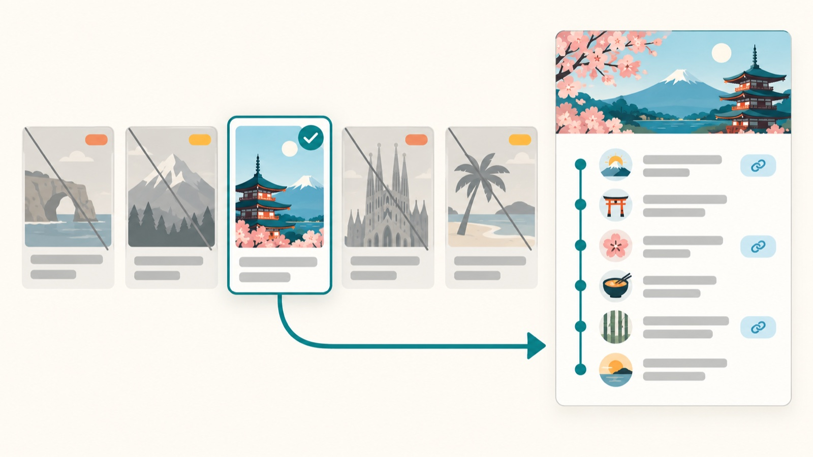

# travel-buddy: decide *where to go* first, then hand you an itinerary you can actually book

<p align="center">
  <a href="README_CN.md"><strong>简体中文</strong></a>
</p>

<p align="center">
  <a href="LICENSE"></a>
  
  
  
  
  
</p>

<p align="center">
  <a href="#install"></a>
  <a href="#install"></a>
  <a href="https://clawhub.ai/dong845/skills/travel-buddy"></a>
  <a href="https://skillhub.cn/skills/user_f486c577/travel-buddy"></a>
</p>

<p align="center">
  
</p>

<p align="center"><sub>Free and open source · runs entirely on your own machine · no account, no cloud</sub></p>

> **A travel agent that refuses to invent a price, refuses to call a trip "bookable" before it has checked the last train home, and won't hand you a day-by-day plan until it has proven the destination is even reachable.**

Most AI trip planners answer "I have 7 days and €1,500" with a confident day-by-day itinerary for a city you never chose. travel-buddy treats that as two different jobs. First it decides **where** — generating candidates, applying hard filters, and explaining what it threw away and why. Only once a destination is genuinely settled does it build the plan, and then it delivers a **self-contained HTML page** with real routes, real booking links, and a per-person budget where every line has a source and a check time.

It is a skill for [Claude Code](https://claude.ai/code) and [Codex](https://openai.com/codex). You talk to it in your terminal; it runs a short local browser form for intake, researches the volatile facts live, and saves the result into a folder on your machine. Nothing leaves your computer except the research queries, and the page it makes contains no third-party script.

<p align="center">
  <a href="#start-here"><strong>Start here</strong></a> ·
  <a href="#what-you-get"><strong>What you get</strong></a> ·
  <a href="#what-makes-it-different"><strong>What's different</strong></a> ·
  <a href="#what-it-will-ask-you"><strong>What it asks</strong></a> ·
  <a href="#quick-start"><strong>Quick start</strong></a> ·
  <a href="#troubleshooting"><strong>Troubleshooting</strong></a>
</p>

---

<a id="start-here"></a>

## Start here

You do not pick a mode. Say what you already have, and the mode follows from it:

| You have | Mode | What you get |
| --- | --- | --- |
| No destination, or just a continent | **Discovery** | 3–5 ranked candidates with trade-offs and an exclusion log |
| A country/region but no city | **Constrained discovery** | Subregions and cities compared before any planning |
| A destination you've decided on | **Construction** | A full day-by-day plan + the two deliverables |
| An existing plan and a new constraint | **Incremental replanning** | Only affected elements recomputed, with a change log |

Once it is [installed](#install), that looks like this:

```text
Use travel-buddy — 7 days in May, about €1,500, leaving from Amsterdam. Where should I go?
Use travel-buddy — somewhere in Japan for 8 days in autumn; help me pick the cities first.
Use travel-buddy — plan six days in Switzerland for two, lakes and old towns, no long walks.
Use travel-buddy — here is my saved plan, my dates moved a week later. What changes?
```

It opens one local form for the things that decide the trip, then works. Discovery never silently collapses into Construction: a fixed scope that names no actual place is *blocked*, not guessed at.

---

<a id="what-you-get"></a>

## What you get

Plain files, saved to a folder you own — the first two are the deliverables a Construction task is not finished without, the third rides along:

| Artifact | What it is |
| --- | --- |
| `plans/<date>-<title>.json` | The full plan as structured data — every option, price basis, source URL and assumption |
| `html/<date>-<title>.html` | A single self-contained page: timed days, segment-by-segment maps, booking cards, budget table, source register |
| `plans/<date>-<title>.ics` | The same trip as a calendar file, so it reaches your phone with reminders attached |

**What is on the page.** Every day as a timeline with real times and walking minutes; each leg with a working directions link routed to the provider that actually works there; booking cards that open a search you complete yourself; a per-person budget where every row names its basis and the date it was checked; inline figures for walking load, budget composition and how spread out each day is; freely-licensed photographs of the actual places, embedded so the page works offline; a panel answering the first hour on the ground (can I pay, can I get online, who do I call, am I insured); and a source register listing what was checked, when, and what still needs a recheck before you buy.

**What is *not* on it.** Anything nobody checked, unless it is labelled as unchecked. A plan saved without a verification pass prints a **"not fact-checked"** banner above everything else, in your own language.

---

## What makes it different

Plenty of tools will write you an itinerary. The difference is what happens to the claims inside it:

- 🧭 **It decides *where* before it decides *what*** — candidates, hard filters, and a written record of what it threw out and why. A destination that fails a hard constraint cannot win on charm.
- 🔎 **It checks the thing that actually breaks the trip** — the last connection home, the museum that is closed that Monday, the airport that does not fly there at all.
- 🧾 **No price, hour or entry rule without a source and a date** — and where it could not check something, the page says so instead of sounding confident.
- 🔗 **Browse, never transact** — every link opens a search you complete yourself. It never logs in, never touches payment, and never calls anything "booked" because a website displayed it.
- 🚦 **Rules are gates, not good intentions** — four programs run before anything is saved, and a plan that skips the fact-checking pass prints a banner saying so on its own front page.
- 💻 **Local, and yours** — plain files in a folder you own, no account, no cloud sync, standard library only, and a page with no third-party script in it.

Three of those, from real runs:

**The trip that was never possible.** Qiqihar to Shenzhen: the local airport's route map has eight destinations and Shenzhen is not among them, so "direct flights only" was infeasible before any itinerary existed. The return was then chosen by working *backwards* from the last connecting train of the day (21:35), and the museum on the walking day turned out to be closed that Monday.

**The channel that cost ¥2,761.** The same four flights priced ¥4,259 on the domestic site and ¥7,020 on the international one — the difference between fitting the budget and not. So each booking channel carries its access status (`available` / `limited` / `unknown`) rather than assuming a visible search result means you can complete the purchase.

**The plan that passed every structure check and was still wrong.** One run shipped a visa conclusion that stopped at the visa and missed the EVUS enrolment that gets Chinese passport holders turned away at check-in; two "competing" flights that were one aircraft sold twice; a free tour booked on a day it does not run; dinners at venues that close three hours earlier; and a "lightest walking day" that was the heaviest, for a traveller who had asked to avoid long walks. Well-formed and true are different axes, so a separate fact-checking pass answers the second — and a plan that skipped it says so on its own front page.

---

## What it will ask you

Seven things decide the trip, and it will not call any destination a strong fit until it knows them or has visibly assumed them:

1. **Origin** — city, country, acceptable airports (never inferred from the city; one person's metro area is another's two-hour transfer)
2. **Travel window** — exact dates when you have them, else month + duration, plus flexibility and any fixed commitment
3. **Party** — count, ages that matter, mobility/health needs, and dietary or religious restrictions
4. **Budget** — **per person**, with currency, target vs. hard cap, and which categories it covers
5. **Destination scope** — `fixed` / `anchored` / `continent` / `open`
6. **Trip purpose** — changes what a good day looks like more than most preference fields
7. **Experience direction** — natural / cultural / balance, then 2–4 specific subtypes with the top two ranked

Everything that only matters *after* a destination is chosen — rooms, breakfast, cancellation, cabin, baggage, map apps — sits in collapsed optional blocks so the questions that decide the trip stay readable.

**How far it will commit on what it knows.**

| It knows | It will give you |
| --- | --- |
| Origin, rough window, rough budget, scope, broad direction | An **exploratory inspiration list**, labelled as such |
| …plus party and the high-impact filters (entry, travel time, weather, mobility) | A **ranked recommendation** |
| …plus exact dates, entry status, budget scope, lodging and mobility confirmed | A **bookable plan** — and volatile facts get rechecked before you act |

Scoring only runs on candidates that already cleared the hard filters, and a score is a summary — never the whole explanation. Nothing is ever called **booked** because a website displayed it; that word is reserved for a transaction you tell it you completed.

---

## Quick start

### Install

Requires **Python 3.10+** (developed on 3.13). There is nothing to `pip install` — every script is standard library only. Pick whichever of the four paths suits you.

**Option 1 — one line with [`npx skills`](https://github.com/vercel-labs/skills)** (simplest):

```bash
npx skills add dong845/travel-buddy
```

It prompts for the agent and scope; `-g` installs globally, `-a claude-code` / `-a codex` skips the prompt, `-y` runs non-interactively.

**Option 2 — as a Claude Code plugin** (managed updates, and the only path that reaches cloud sessions):

```text
/plugin marketplace add dong845/travel-buddy
/plugin install travel-buddy@travel-buddy
/reload-plugins
```

Invoked as `/travel-buddy:travel-buddy`. Remove any manual copy in `~/.claude/skills/` or you will see the skill twice, and run `/plugin marketplace update travel-buddy` for new releases — third-party marketplaces do not auto-update.

**Option 3 — clone and symlink** (best if you intend to edit it; edits take effect immediately, which the plugin cache does not allow):

```bash
git clone --depth 1 https://github.com/dong845/travel-buddy.git ~/code_project/travel-buddy
ln -s ~/code_project/travel-buddy ~/.claude/skills/travel-buddy
```

**Option 4 — from [ClawHub](https://clawhub.ai/dong845/skills/travel-buddy)**, the marketplace for [OpenClaw](https://clawhub.ai) agents:

```bash
openclaw skills install @dong845/travel-buddy
```

travel-buddy is also listed on **[SkillHub](https://skillhub.cn/skills/user_f486c577/travel-buddy)**, a Chinese-language skills community — useful for browsing and comparing skills, though installation still goes through one of the four paths above.

Then create the workspace once:

```bash
cd ~/.claude/skills/travel-buddy
python scripts/travel_workspace.py init          # makes ~/Travel Buddy/{profiles,plans,html}
```

### Use it

In Claude Code, type `/travel-buddy`, or just describe the trip — "help me find somewhere warm for a week in March" is enough to trigger it.

For a first trip, let it run the guided form:

```bash
python scripts/start_intake_workflow.py --assistant auto
```

It prints a `http://127.0.0.1:<random-port>/?token=…` link. Open it, fill the form, save — the same browser tab moves on to the current-trip form. Submitting that hands the saved path back to the assistant you are already talking to; it never starts a second agent behind your back ([why](docs/internals.md#never-spawns-a-second-planner)).

Either way you never download, move, upload, or paste JSON, and you never have to type "continue".

```bash
# review/edit saved stable preferences first, then continue to the trip form
python scripts/start_intake_workflow.py --edit-profile

# more than one profile? pass the ID (not a path)
python scripts/start_intake_workflow.py --profile alice --assistant claude

# skip the automatic hand-off entirely
python scripts/start_intake_workflow.py --assistant none

# no way to background a command in your CLI? let the script do it
python scripts/start_intake_workflow.py --detach
```

---

## Workspace and privacy

```
~/Travel Buddy/
├── profiles/   # opt-in reusable traveler profiles
├── plans/      # intake, workflow events, plan JSON, discovery logs
└── html/       # final browse-only itinerary pages
```

**What is stored:** nationality, residence country and residence-*status category*, languages, home city and acceptable airports, usual currency, pace, lodging style, accessibility and dietary needs, visited places, wish list, explicit exclusions.

**What is never stored:** passport or document numbers and images, visa expiry dates, payment or bank details, credentials, exact home addresses, local identity numbers, private account context. The intake server also *rejects* a submission containing such fields rather than quietly saving it.

A profile is only created after you tick the consent box in the form. Your newest instruction always beats a saved value.

**Deleting a profile** is deliberately manual — there is no `forget` subcommand. Confirm the exact resolved path, then remove that one file:

```bash
rm "~/Travel Buddy/profiles/<the-one-you-named>.json"
```

Never remove the whole workspace to satisfy a profile deletion.

---

## Troubleshooting

**"Unsupported trip request format" on submit.** The form's work mode must agree with its destination scope (`fixed` → `construction`, `anchored` → `constrained_discovery`, otherwise `discovery`). The server rejects a contradiction on purpose, so a saved file cannot claim it still needs a destination found while one is already fixed.

**The automatic hand-off did nothing.** Under `--assistant auto` that is usually correct, not a fault: whenever the skill is running *inside* an assistant, the runner stands down and prints the saved intake path for the assistant you are already talking to. It used to spawn a second, unattended agent there, which produced two conflicting plans in one workspace. It no longer launches from a bare terminal either — a pty is not proof of a human, and the harnesses that allocate one were getting the spawn — so under `auto` it always stands down and prints one line saying why and how to override. Force a detached run with `--assistant codex` or `--assistant claude` (or `TRAVEL_BUDDY_ASSISTANT=codex`); then check `plans/destination-discovery-*.log`, and `plans/destination-discovery-*.pid.json` for the PID and a stop command. If the CLI is missing from `PATH`, the runner says so.

**`--edit-profile` seemed to be ignored.** It only applies when a profile already exists; with an empty `profiles/` directory the workflow goes straight to creating a new one.

**A freshly created profile validates but is empty.** `create-profile` writes a consented *shell*; `validate-profile` will call it VALID with every substantive field still null. Fill it in — via `--edit-profile` — before relying on it.

**It refuses to save: "No verification report."** That is the gate working. Run the pass in [`references/verification.md`](references/verification.md) — five truth domains plus the two network-free auditors, seven blocks on the full pass, four if the plan qualifies for the light tier — save the report, and pass `--verification <report.json>`. If you are deliberately saving a draft, `--unverified` saves it and stamps a "not fact-checked" banner on the page so nobody mistakes it for booking-ready.

---

## Security

The intake forms are served by a temporary HTTP server bound to `127.0.0.1` only, on a random port, accepting exactly one valid submission before shutting down. There is no third-party script, no remote request, no login, no payment step and no upload in the page.

Loopback binding is not the only barrier. A one-time token is minted at startup and carried in the link the terminal prints, and every page load and every submission without it is refused; a cross-site POST is refused again by an `Origin` check and by requiring `Content-Type: application/json`, which forces a preflight this server never answers; and a lock admits exactly one submission, so a double-click cannot save twice or start two agents. On top of that sit the random port and the sensitive-field scan on whatever is saved.

The honest residual limit: any process running as **you** on **your** machine can read the token out of the terminal or the process list, so this defends against a hostile web page, not against local malware already running under your account.

The skill will not recommend a VPN, proxy, account workaround or credential sharing to make a blocked service work, and it will not perform bookings, payments, or account changes on your behalf.

---

## How it works inside

The pipeline, every gate, every script, and the defect that put each rule there: **[docs/internals.md](docs/internals.md)**. You do not need it to use travel-buddy.

---

## License

MIT — see [LICENSE](LICENSE).
